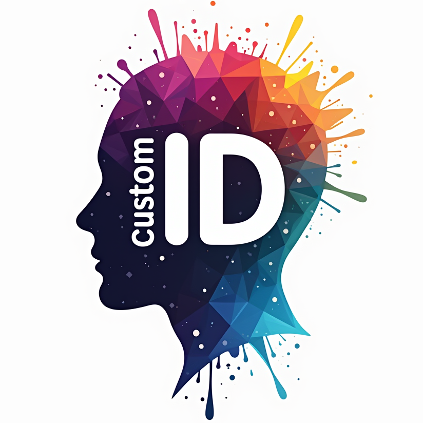
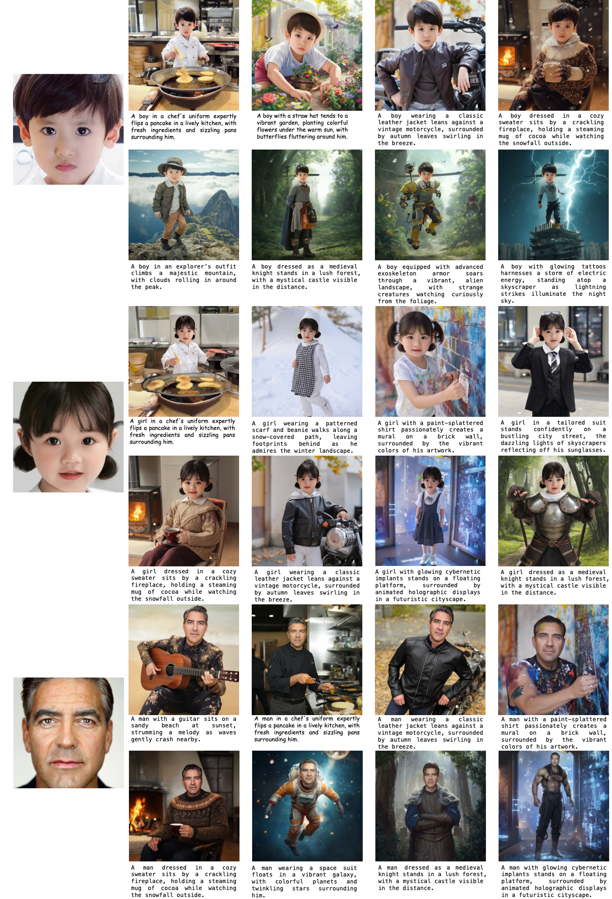
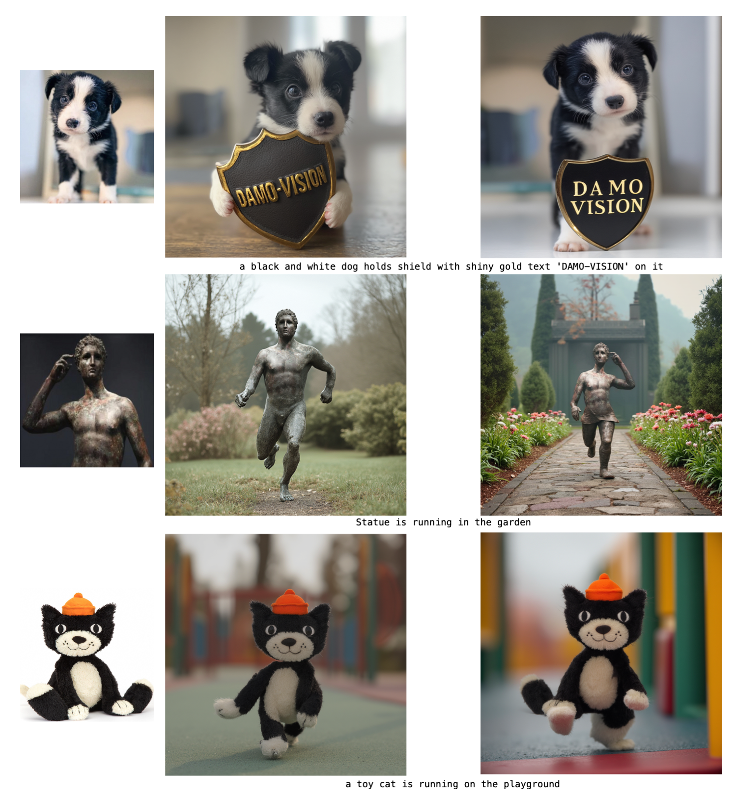

## FLUX-customID: Realistically Customize Your Personal ID to Perfection

This repository is the official implementation of FLUX-customID. It is capable of generating images based on your face image at a level equivalent to real photographic quality. Our base model is FLUX.dev, which ensures the generation of high-quality images.

## News
- 🌟**2024-11-13**: Released the code and weights for FLUX-customID.

## Gallery
Here are some example samples generated by our method.

<center></center>

## Quick Start

### 1. Setup Repository and Environment

```
conda create -n customID python=3.10 -y
conda activate customID
conda install pytorch==2.4.0 torchvision==0.19.0 pytorch-cuda=11.8 -c pytorch -c nvidia  -y
pip install -i https://mirrors.cloud.tencent.com/pypi/simple  diffusers==0.31.0 transformers onnxruntime-gpu insightface sentencepiece matplotlib imageio tqdm numpy einops accelerate peft
```

### 2. Prepare Pretrained Checkpoints

```
git clone https://github.com/damo-cv/FLUX-customID.git
cd FLUX-customID

mkdir pretrained_ckpt
cd pretrained_ckpt

#Download CLIP
export HF_ENDPOINT=https://hf-mirror.com
pip install -U "huggingface_hub[cli]"

huggingface-cli download \
--resume-download "laion/CLIP-ViT-H-14-laion2B-s32B-b79K" \
--cache-dir your_dir/

ln -s your_dir/models--laion--CLIP-ViT-H-14-laion2B-s32B-b79K/snapshots/de081ac0a0ca8dc9d1533eed1ae884bb8ae1404b pretrained_ckpt/openclip-vit-h-14

#Download FLUX.1-dev
huggingface-cli download \
--resume-download "black-forest-labs/FLUX.1-dev" \
--cache-dir your_dir/

ln -s your_dir/models--black-forest-labs--FLUX.1-dev/snapshots/303875135fff3f05b6aa893d544f28833a237d58 pretrained_ckpt/flux.1-dev

#Download FLUX-customID
Download our trained checkpoint from https://huggingface.co/Damo-vision/FLUX-customID and place FLUX-customID.pt in the floder pretrained_ckpt/
```

### 3. Quick Inference
```
run infer_customID.ipynb
```

## Preview for CustomAnyID
We would like to announce that we are currently working on a related project, **CustomAnyID**. Below are some preliminary experimental results:

<center></center>

## Preview for Controlnet
We would like to announce our Controlnet model. Below are some preliminary experimental results:
<center></center>


## Contact Us
Dongyang Li: [yingtian.ldy@alibaba-inc.com](yingtian.ldy@alibaba-inc.com)

## Acknowledgements
The partial code is implemented based on [IP-Adapter](https://github.com/tencent-ailab/IP-Adapter) and [PhotoMaker](https://github.com/TencentARC/PhotoMaker).
